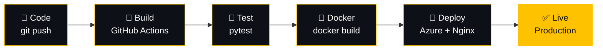
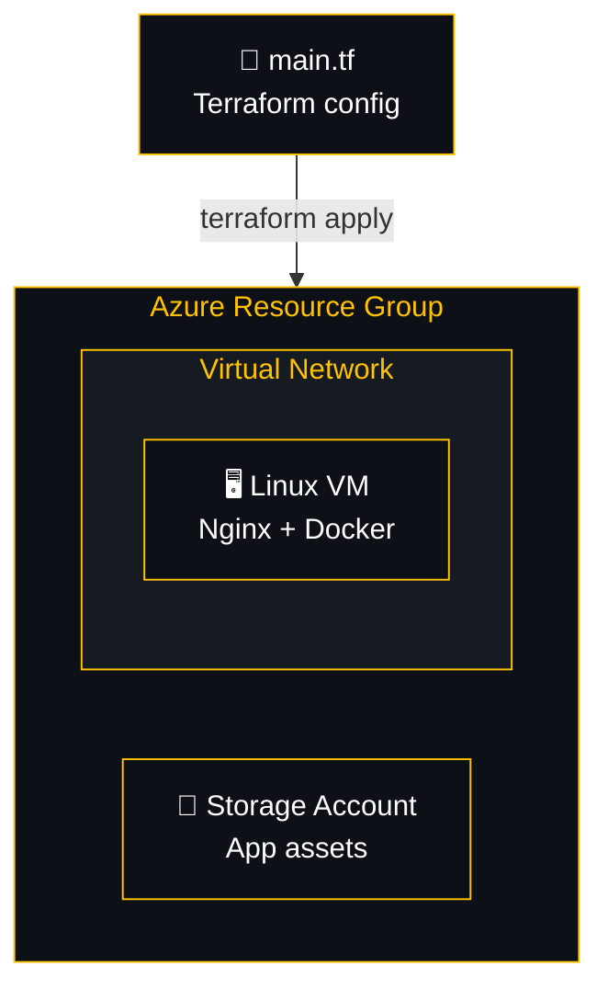

<div align="center">


<a href="https://github.com/dharmendra0107">
  
</a>

<br><br>


<br><br>

<a href="#-about">About</a> •
<a href="#%EF%B8%8F-tech-stack">Tech Stack</a> •
<a href="#-featured-projects">Projects</a> •
<a href="#-pipeline--infrastructure">Pipeline</a> •
<a href="#-github-stats">Stats</a> •
<a href="#-connect-with-me">Connect</a>

</div>

<br>

## ⚡ About

```yaml
role: DevOps Engineer @ Sipher Web Pvt. Ltd.
location: Lucknow, India
focus: [CI/CD, Containers, Infrastructure-as-Code, Cloud Automation]
currently_learning: [Kubernetes, AWS, GCP]
impact: "Automated a manual Django deploy → GitHub Actions CI/CD → 60% faster releases"
fun_fact: "I'd rather script it once than click it twice."
```

- 🔧 Building and maintaining **CI/CD pipelines** with GitHub Actions — build, test, deploy, on every merge
- 🐳 Containerising applications with **Docker**, configuring **Nginx** for zero-downtime rollouts
- ☁️ Provisioning cloud infrastructure as versioned code with **Terraform** on **Microsoft Azure**
- 🐍 A Python/Django/Bash scripting background that turns manual runbooks into automation
- 📚 Currently deep in the **DevOps Insiders Program** — hands-on labs across Azure, AWS & GCP
- 📫 **dkmom00@gmail.com**&nbsp; · &nbsp;💬 Ask me about CI/CD, Docker, Terraform, or Linux server ops

<br>

## 🛠️ Tech Stack

<div align="center">

**Linux · Scripting · Version Control**


<br><br>

**Containers · Orchestration**


<br><br>

**CI/CD · Automation**


<br><br>

**Cloud · Infrastructure as Code**


<br><br>

**Backend · Databases**


</div>

<br>

## 🚀 Featured Projects

<table>
<tr>
<td width="50%" valign="top">

**🔁 Django Deployment Automation**
Turned a manual SSH-and-restart deploy into a GitHub Actions CI/CD pipeline.
`GitHub Actions` `Bash` `Django` `Nginx`
📉 60% faster releases · [Profile →](https://github.com/dharmendra0107)

</td>
<td width="50%" valign="top">

**☁️ Terraform + Azure Infra Lab**
IaC lab provisioning resource groups, VMs & networking with remote state.
`Terraform` `Azure` `IAM`
🧱 Reviewable, versioned infra · [Profile →](https://github.com/dharmendra0107)

</td>
</tr>
<tr>
<td width="50%" valign="top">

**📦 Dockerized BMI Calculator**
Multi-stage Docker build practice — trimming image size, container workflow.
`Docker` `Multi-stage builds`
[Code →](https://github.com/dharmendra0107/BMI_calculator) · [Live →](https://dharmendra0107.github.io/BMI_calculator/)

</td>
<td width="50%" valign="top">

**🌦️ Weather App — API Monitoring**
Real-time weather app with uptime/response monitoring on an external API.
`Monitoring` `REST API`
[Code →](https://github.com/dharmendra0107/Weather_App) · [Live →](https://dharmendra0107.github.io/Weather_App/)

</td>
</tr>
</table>

<br>

## 🎬 Pipeline & Infrastructure

**How a commit reaches production:**



**Terraform-provisioned Azure infrastructure:**



**Production dashboard — at a glance:**

<div align="center">


</div>

<br>

## 📊 GitHub Stats

<div align="center">


<br>


</div>

<br>

## 🌐 Connect With Me

<div align="center">

<a href="https://www.linkedin.com/in/dharmendra0107/" target="_blank"></a>
<a href="mailto:dkmom00@gmail.com"></a>
<a href="https://api.whatsapp.com/send/?phone=916306008818" target="_blank"></a>
<a href="https://github.com/dharmendra0107" target="_blank"></a>

<br><br>


</div>


